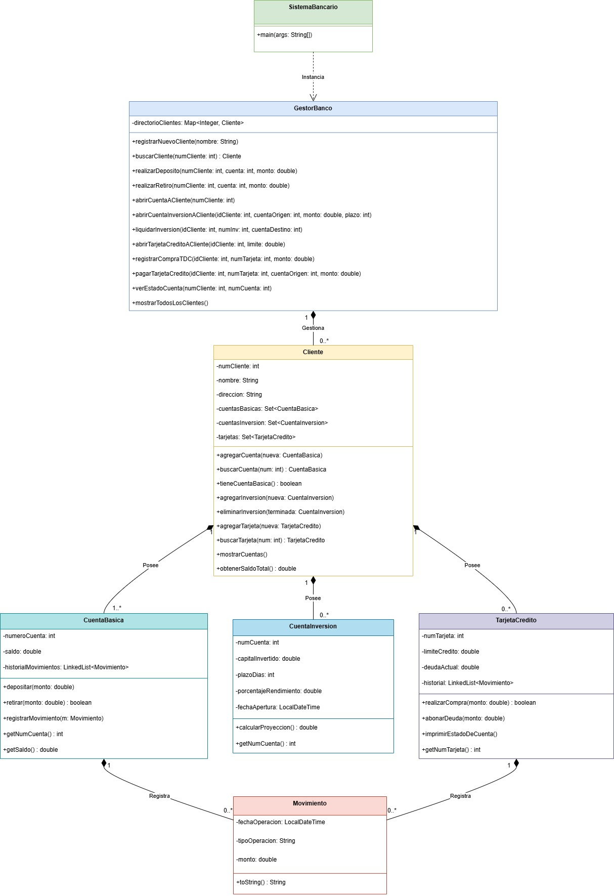

# Sistema de Administración de Cuentas Bancarias

> Proyecto de software desarrollado en Java enfocado en la aplicación práctica de Programación Orientada a Objetos (POO) y el dominio del **Java Collections Framework**.

Este sistema simula el entorno de trabajo de un cajero bancario, permitiendo la gestión integral de clientes, operaciones transaccionales y la proyección de rendimientos mediante cuentas de inversión.

## Descripción General

El objetivo principal de este proyecto es diseñar una arquitectura robusta y escalable sin depender de bases de datos externas, gestionando el estado y la persistencia en memoria mediante el uso estratégico de colecciones (`List`, `Set`, `Map`). 

El sistema está diseñado en capas (separando la lógica de negocio de la interfaz de usuario), lo que permite una transición limpia de una interfaz por línea de comandos (CLI) a una Interfaz Gráfica de Usuario (GUI).

## Características y Funcionalidades

- **Gestión de Clientes:** Registro de nuevos usuarios y modificación de datos personales. Búsqueda optimizada en tiempo constante $O(1)$.
- **Operaciones de Caja (Cuentas Básicas):** Depósitos y retiros con validación de fondos y actualización de saldos en tiempo real.
- **Módulo de Inversiones:** Creación de cuentas de inversión mediante transferencia de fondos desde la cuenta básica. Implementa cálculo de rendimientos basados en plazos definidos (simulación de fechas).
- **Historial Transaccional:** Registro inmutable y cronológico de cada movimiento (depósitos, retiros, apertura de inversiones).
- **Módulo de Crédito (Feature Extra):** Gestión de tarjetas de crédito con control de límite y saldo deudor.

## Estructuras de Datos (Collections)

Para garantizar la integridad y eficiencia de los datos, el modelo de negocio implementa las siguientes estructuras:

* **`Map<String, Cliente>` (Tabla Hash):** Utilizado en el Controlador del banco para almacenar el directorio de clientes. Permite que el cajero localice la información de un cliente de forma inmediata utilizando su Número de Cliente como llave.
* **`Set<Cuenta>` (Conjuntos):** Implementado en la entidad Cliente para almacenar sus productos financieros (Cuentas Básicas e Inversiones). Garantiza matemáticamente que no existan cuentas duplicadas asignadas a un mismo titular.
* **`List<Movimiento>` (Listas):** Utilizado en el interior de cada Cuenta para almacenar el historial de transacciones. Asegura que los movimientos mantengan su orden cronológico exacto para la generación de estados de cuenta.

## Arquitectura del Sistema

El sistema fue diseñado siguiendo los principios de la Programación Orientada a Objetos (POO), asegurando un bajo acoplamiento y una alta cohesión entre el gestor del banco y las entidades financieras.



## Tecnologías Utilizadas

- **Lenguaje:** Java (JDK)
- **Paradigma:** Programación Orientada a Objetos (POO)
- **Entorno de Desarrollo (IDE):** Apache NetBeans
- **Control de Versiones:** Git & GitHub
- **Documentación Técnica:** Javadoc y LaTeX

## Instalación y Ejecución

Tienes dos opciones para probar el sistema: usar el ejecutable directo o compilar el código fuente localmente.

### Opción 1: Usar el Ejecutable (Rápido)
Si solo deseas probar el funcionamiento del banco sin necesidad de un IDE:
1. Dirígete a la sección de **Releases** en este repositorio.
2. Descarga el archivo `SistemaBancario.jar` de la última versión (v1.0).
3. Abre tu terminal en la carpeta donde lo descargaste y ejecuta el siguiente comando:
   ```bash
   java -jar SistemaBancario.jar

### Opción 2: Compilación desde el Código Fuente
Para ejecutar este proyecto en tu entorno local (Para desarrolladores o profesores que deseen explorar la estructura del código):

1. Clona este repositorio:
   ```bash
   git clone [https://github.com/TuUsuario/Sistema-Bancario-Java.git](https://github.com/TuUsuario/Sistema-Bancario-Java.git)

Abre el proyecto en tu IDE preferido (se recomienda Apache NetBeans).

Asegúrate de tener instalado el JDK 8 o superior.

Compila y ejecuta el archivo principal SistemaBancario.java ubicado en src/sistemabancario/.

##  Equipo de Desarrollo

Proyecto desarrollado para la asignatura de Programación Orientada a Objetos de la Facultad de Ingeniería (UNAM).

* **Francisco José Coutiño Morales** - [Mi GitHub](https://github.com/FranciscoCou077)
* **Ernesto Flamenco Villaseñor** - [Su GitHub](https://github.com/ernestogoretzka)
* **Jaime Erick Torres Nava** - [Su GitHub](https://github.com/Jaimetn19)
